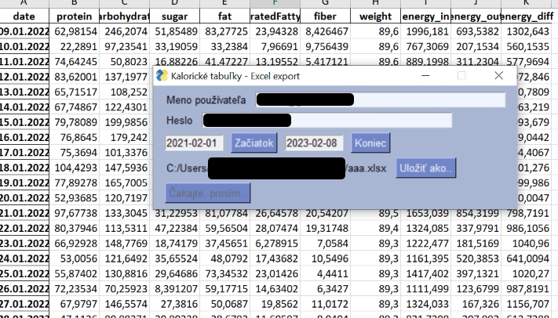

# Skript pre stiahnutie štatistík z účtu na serveri kaloricketabulky.sk a ich uloženie do Excel súboru.



## Návod
  * v prípade, ak používate 2FA (prihlásenie cez google/facebook): resetujte heslo na https://www.kaloricketabulky.sk/forgotten-password
  * Linux:
    * nainštalujte závislosti a spustite skript
      ```
      python -m venv kt_dump
      . kt_dump/bin/activate
      pip install -r requirements.txt
      python kt_dump.py
      ```
  * Windows:
    * stiahnite a spustite [kt_dump.exe](https://github.com/jose1711/kt_dump/raw/master/kt_dump.exe)
  * vyplňte údaje
  * kliknite na OK a počkajte na výsledok

Popis jednotlivých polí vo výslednom súbore Excel:
 * protein, carbohydrate, sugar, fat, saturatedFattyAcid, fiber = bielkoviny, sacharidy, cukry, tuky, nasýtené mastné kyseliny, vláknina
 * energy_in, energy_out, energy_diff = energetický príjem, energetický výdaj, rozdiel
 * weight = hmotnosť

## Prečo?

I napriek GDPR - časti o interoperabilite dát Kalorické tabuľky (KT) neobsahujú nástroj na export dát používateľa. Autori KT sa ho podľa všetkého
ani nechystajú implementovať. Používateľ sa tak nedokáže jednoduchým spôsobom dopracovať s dátami, ktoré na server Kalorické tabuľky nahral.
